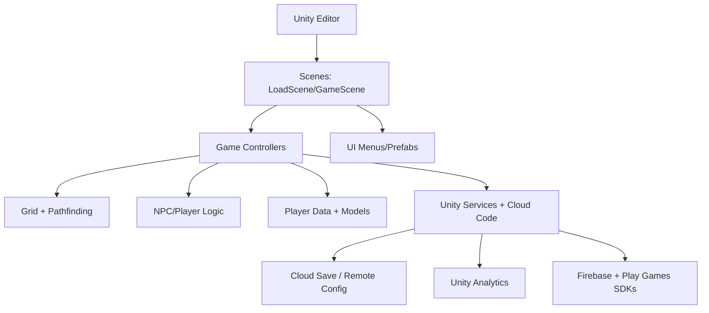

# UnityProject

## 1. What this repository is
A Unity 2D isometric management game project with gameplay, UI, and editor tooling in C#; it is not a packaged build or a backend service. Evidence: `Assets/Scripts`, `Assets/Scenes/LoadScene.unity`, `Assets/Scenes/GameScene.unity`.

## 2. Why it exists
To prototype and iterate on a restaurant/tycoon-style game with NPCs, grid-based placement, and progression systems for Unity developers and designers. Evidence: `Assets/Scripts/Game`, `Assets/Scripts/Game/Players`, `Assets/Scenes/GameScene.unity`.

## 3. Quickstart
Prerequisites:
- Unity Editor 2022.3.11f1 (from `ProjectSettings/ProjectVersion.txt`).
- Android/iOS toolchain versions: Unknown; would be confirmed in Unity build documentation or CI scripts (none found).

Run locally:
- Open the project in Unity Hub, then open `Assets/Scenes/LoadScene.unity` and press Play (scenes listed in `ProjectSettings/EditorBuildSettings.asset`).

Run tests:
- Unity Test Runner in the editor using EditMode and PlayMode tests under `Assets/Scripts/Tests`.
- CLI test command: Unknown; would be confirmed by CI scripts or a test runner script (none found).

Troubleshooting:
- Networked services are disabled by default (`Settings.DisableNetwork = true` in `Assets/Scripts/Settings.cs`); enable only if Unity Services are configured.
- Editor debug panels require play mode and the game scene (see `Assets/Editor/GridDebugPanel.cs`, `Assets/Editor/StateMachineDebugPanel.cs`).

## 4. Architecture at a glance

Scenes load gameplay and UI; controllers orchestrate NPCs, grid placement, and player data, with optional Unity Services and Firebase integrations referenced by scripts and Android dependencies. Evidence: `Assets/Scenes/LoadScene.unity`, `Assets/Scripts/Game`, `Assets/Scripts/Services`, `ProjectSettings/AndroidResolverDependencies.xml`.

## 5. Core components
- `Assets/Scenes/`: entry scenes (`LoadScene.unity`, `GameScene.unity`).
- `Assets/Scripts/Game/Controllers/`: gameplay orchestration for NPCs, grid objects, menus, and misc controllers.
- `Assets/Scripts/Game/Grid/`: grid model, tiles, and pathfinding.
- `Assets/Scripts/Game/Players/` and `Assets/Scripts/Game/Players/Model/`: player state, progression, and data models.
- `Assets/Scripts/Game/UI/Menus/`: UI menu logic and camera controls.
- `Assets/Scripts/Util/`: shared utilities and collections.
- `Assets/Scripts/Services/`: Unity Services auth/analytics and Cloud Code hooks.
- `Assets/Editor/`: editor debug panels and build scripts.
- `Assets/Resources/`: prefabs, sprites, and UI assets.

## 6. Interfaces
- Unity scenes: `Assets/Scenes/LoadScene.unity`, `Assets/Scenes/GameScene.unity` (build list in `ProjectSettings/EditorBuildSettings.asset`).
- Editor menu items:
  - `Idle Tycoon - Business/Play: First Scene` (from `Assets/Editor/GridDebugPanel.cs`).
  - `Idle Tycoon - Business/Debug: Grid Panel` (from `Assets/Editor/GridDebugPanel.cs`).
  - `Idle Tycoon - Business/Debug: NPC State Machine` (from `Assets/Editor/StateMachineDebugPanel.cs`).
- Cloud Code handler: `module.exports` in `Assets/Scripts/Services/CloudCode/CloudCodeGetPlayerData.js`.
- Build entrypoints: `BuildScript.PerformAndroidBuild()` and `BuildScript.PerformIOSBuild()` in `Assets/Editor/BuildScript.cs`.

## 7. Configuration
- Gameplay constants and toggles: `Assets/Scripts/Settings.cs`.
- Unity project settings (product name, platform settings, cloud project ID, signing paths): `ProjectSettings/ProjectSettings.asset`.
- Unity Services connection settings: `ProjectSettings/UnityConnectSettings.asset`.
- Input System settings: `Assets/InputSystem.inputsettings.asset`.
- Android build templates and dependency resolver settings: `Assets/Plugins/Android/mainTemplate.gradle`, `Assets/Plugins/Android/gradleTemplate.properties`, `ProjectSettings/AndroidResolverDependencies.xml`.
- Google Play Games plugin metadata: `Assets/GPGSIds.cs`, `ProjectSettings/GooglePlayGameSettings.txt`, `Assets/Plugins/Android/GooglePlayGamesManifest.androidlib/AndroidManifest.xml`.
- Remote Config data store placeholder: `Assets/Editor/RemoteConfig/Data/RemoteConfigDataStoreAsset.asset`.
- No `.env` files are present.

Secrets and injection:
- `ProjectSettings/ProjectSettings.asset` contains platform identifiers and a `ps4Passcode` value; treat as sensitive.
- No environment-variable based secret injection is defined in this repo.

## 8. Dependencies and external services
Dependencies:
- Unity packages (URP, Input System, Test Framework, Services SDKs) listed in `Packages/manifest.json`.
- Unity analyzer package path configured in `omnisharp.json` and stored under `NuGet/microsoft.unity.analyzers.1.13.0.nupkg`.

External services and SDKs:
- Unity Services (Analytics, Authentication, Cloud Code, Remote Config, LevelPlay) referenced in `Packages/manifest.json`, `Assets/Scripts/Services/UnityAuth.cs`, `Assets/Scripts/Services/UnityAnalytics.cs`, and `Assets/Scripts/Services/CloudCode/CloudCodeGetPlayerData.js`.
- Firebase and Google Play Services dependencies defined in `ProjectSettings/AndroidResolverDependencies.xml` and `Assets/Plugins/Android/mainTemplate.gradle`.
- Google Play Games Services IDs in `Assets/GPGSIds.cs` and `Assets/Plugins/Android/GooglePlayGamesManifest.androidlib/AndroidManifest.xml`.

## 9. Quality and safety
Tests:
- EditMode and PlayMode test assemblies under `Assets/Scripts/Tests/EditMode` and `Assets/Scripts/Tests/PlayMode`.
- Run via Unity Test Runner (GUI).

CI:
- No CI configuration found (only `Jenkinsfile.meta` exists).

Linting/formatting:
- .NET analyzer settings in `UnityProject/.editorconfig` and analyzer package referenced in `UnityProject/omnisharp.json`.

Static analysis/security:
- No explicit security scanning or dependency audits found.

Verification:
- `test -f UnityProject/README.md`

## 10. Sensitive information review
Status: Needs attention

Reviewed areas:
- `Assets/GPGSIds.cs`
- `Assets/InputSystem.inputsettings.asset`
- `Assets/Editor/BuildScript.cs`
- `Assets/Editor/GridDebugPanel.cs`
- `Assets/Editor/StateMachineDebugPanel.cs`
- `Assets/Editor/RemoteConfig/Data/RemoteConfigDataStoreAsset.asset`
- `Assets/Scripts/Settings.cs`
- `Assets/Scripts/Services/UnityAuth.cs`
- `Assets/Scripts/Services/UnityAnalytics.cs`
- `Assets/Scripts/Services/CloudCode/CloudCodeGetPlayerData.js`
- `Assets/Plugins/Android/mainTemplate.gradle`
- `Assets/Plugins/Android/gradleTemplate.properties`
- `Assets/Plugins/Android/GooglePlayGamesManifest.androidlib/AndroidManifest.xml`
- `ProjectSettings/ProjectVersion.txt`
- `ProjectSettings/EditorBuildSettings.asset`
- `ProjectSettings/ProjectSettings.asset`
- `ProjectSettings/UnityConnectSettings.asset`
- `ProjectSettings/GooglePlayGameSettings.txt`
- `ProjectSettings/AndroidResolverDependencies.xml`
- `Packages/manifest.json`
- `UserData/default.user.1.0.0.json`
- `UserData/default.user.1.0.1.json`
- `UserData/default.user.1.0.2.json`
- `UserData/default.user.1.0.3.json`
- `UserData/default.user.1.0.4.json`
- `UserData/fullItemsGame.json`

Findings:
- `ProjectSettings/ProjectSettings.asset`: `ps4Passcode` contains a non-placeholder value; treat as a real secret until confirmed.
- `ProjectSettings/ProjectSettings.asset`: `AndroidKeystoreName` points to a local keystore path, indicating external signing material (keystore file not in repo).
- `Assets/GPGSIds.cs` and `Assets/Plugins/Android/GooglePlayGamesManifest.androidlib/AndroidManifest.xml`: Google Play Games identifiers (IDs), which are not secrets but are production identifiers.

Actions taken:
- None; no values modified.

Notes:
- Binary assets were not inspected (e.g., `Assets/**/*.prefab`, `Assets/**/*.unity`, `Assets/**/*.png`, `Assets/**/*.asset`, `Assets/**/*.psd`, `Assets/**/*.ttf`, `NuGet/microsoft.unity.analyzers.1.13.0.nupkg`).
- If the PS4 passcode is real, rotate it and keep it out of version control.

## 11. What’s missing
Documentation:
- P1/M: A concise onboarding section with build targets and scene flow. Next action: document the expected play flow and main scene responsibilities.

Tests:
- P1/M: No CLI test command documented. Next action: add a scripted Unity Test Runner invocation and document it.

Security:
- P0/S: Confirm and rotate `ps4Passcode` if real. Next action: replace with a placeholder once validated and store secrets out of repo.

Reliability:
- P2/M: Network service failure handling is commented out in `Assets/Scripts/Services/UnityAuth.cs`. Next action: document intended runtime behavior and retry strategy.

Operations:
- P2/M: No automated build pipeline scripts in repo. Next action: add a CI workflow or document local build usage of `Assets/Editor/BuildScript.cs`.

## Prerequisites
- Unity Editor **2022.3.11f1** (from `ProjectSettings/ProjectVersion.txt`).
- Optional: Unity Services / Google Play Games SDK only when you supply your own IDs and keys.

## Secrets & security
- Sensitive fields in `ProjectSettings/ProjectSettings.asset` and Android manifests are placeholders. Provide real values locally or in CI only; see `SECURITY.md`.
- Do **not** commit keystores, passcodes, or service IDs. Inject them as environment variables or external files in CI.
- Online services are disabled in this open-source build; gameplay runs fully offline.

## Assets & licensing
- Code-only release: proprietary design sources removed. Add art/audio/fonts only if licensed; document sources in `ASSETS_LICENSE.md`.
- Samples moved to `Samples~/SaveSamples` to avoid shipping real saves. Runtime saves still use `Settings.DevSaveDirectory` (`UserData`).

## Running tests
- CLI: `./ci/unity-test.sh` (requires Unity Editor on PATH).
- Editor: Unity Test Runner for EditMode/PlayMode under `Assets/Scripts/Tests`.

## CI
- GitHub Actions workflow `.github/workflows/unity-tests.yml` runs Unity tests in batch mode (needs `UNITY_LICENSE` secret).

## Builds
- Use `Assets/Editor/BuildScript.cs` or standard Unity build targets. Supply platform signing assets outside the repo.

Developer experience:
- P2/S: No build/run command list for Android/iOS. Next action: document required SDKs and Unity Build Settings profiles.

## 12. How this repository is useful
It demonstrates a reusable Unity isometric grid architecture with NPC state machines, grid/pathfinding utilities, and editor debug panels that can be adapted to other management-style games. Evidence: `Assets/Scripts/Game/Grid`, `Assets/Scripts/Util/PathFinding`, `Assets/Editor/GridDebugPanel.cs`, `Assets/Editor/StateMachineDebugPanel.cs`.

## 13. Automation hooks
Project type: Unity 2D game (URP, Input System)
Primary domain: Isometric restaurant/tycoon gameplay
Core entities: Grid tiles/objects, NPCs, player data, upgrades, menus
Extension points: Add NPC states (`Assets/Scripts/Game/Players/NPCStateMachineFactory.cs`), new grid objects/controllers (`Assets/Scripts/Game/Grid`, `Assets/Scripts/Game/Controllers/Grid Objects Controllers`), and UI menus (`Assets/Scripts/Game/UI/Menus`, `Assets/Resources/Menu`).
Areas safe to modify: Gameplay logic under `Assets/Scripts/Game`, utilities under `Assets/Scripts/Util`, editor tools under `Assets/Editor`.
Areas requiring caution and why: `ProjectSettings/ProjectSettings.asset` (platform IDs/signing), `Assets/Plugins/Android/*` (Gradle/dependencies), `Assets/GPGSIds.cs` (auto-generated Play Games IDs).
Canonical commands:
- build: Use `BuildScript.PerformAndroidBuild()` / `BuildScript.PerformIOSBuild()` from `Assets/Editor/BuildScript.cs` (no CLI wrapper documented).
- run: Open `Assets/Scenes/LoadScene.unity` in Unity and press Play.
- test: Use Unity Test Runner (GUI).
