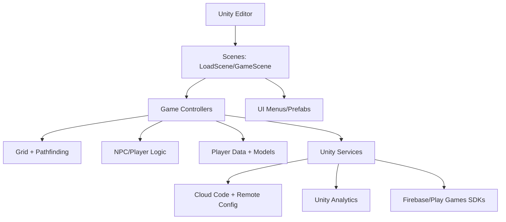

# 1. What this repository is
This is a Unity 2D isometric management game project (tentative “Idle Tycoon - Restaurant”) with gameplay, UI, and editor tooling implemented in C#; it is not a packaged build or a backend service, and it does not include deployment infrastructure. Evidence: `Assets/Scripts`, `Assets/Scenes/LoadScene.unity`, `Assets/Scenes/GameScene.unity`, `ProjectSettings/ProjectSettings.asset`.

# 2. Why it exists
The project appears to prototype or implement a restaurant/cafe management game with NPCs, grid-based placement, and upgrades for player progression. Intended users are Unity developers and designers iterating on gameplay and content. Evidence: `Assets/Scripts/Game`, `Assets/Scripts/Settings.cs`, `Assets/Scenes/GameScene.unity`.

# 3. Quickstart
Prerequisites:
- Unity Editor 2022.3.11f1. Evidence: `ProjectSettings/ProjectVersion.txt`.
- Android/iOS build toolchain versions: Unknown; would be confirmed in Unity Editor settings or build documentation (not found). Evidence search scope: no CI scripts found, no build docs besides `Assets/Editor/BuildScript.cs`.

Run locally:
- Unity Editor: open the project folder, open `Assets/Scenes/LoadScene.unity`, press Play. Evidence: `Assets/Scenes/LoadScene.unity`, `ProjectSettings/EditorBuildSettings.asset`.
- Command-line run: Unknown; would be confirmed by a build/run script or CI pipeline (none found). Expected location: `.github/workflows` or a script in the repo.

Run tests:
- Unity Test Runner: use EditMode and PlayMode tests in `Assets/Scripts/Tests`. Evidence: `Assets/Scripts/Tests/EditMode`, `Assets/Scripts/Tests/PlayMode`.
- Command-line test invocation: Unknown; would be confirmed in CI or test scripts (none found).

Troubleshooting:
- Networked services are disabled by default; set `Settings.DisableNetwork` to `false` to enable Unity Services calls. Evidence: `Assets/Scripts/Settings.cs`, `Assets/Scripts/Services/UnityAuth.cs`.
- Debug grid view requires enabling `Settings.CellDebug` and using the editor debug panels. Evidence: `Assets/Scripts/Settings.cs`, `Assets/Editor/GridDebugPanel.cs`.

# 4. Architecture at a glance

Main components: scenes load the game and UI, controllers orchestrate gameplay, the grid/pathfinding handles movement and placement, and player data models persist state. Optional Unity Services and Firebase integrations are present but networked calls are mostly commented or gated by `Settings.DisableNetwork`. Evidence: `Assets/Scenes/LoadScene.unity`, `Assets/Scripts/Game/Controllers`, `Assets/Scripts/Game/Grid`, `Assets/Scripts/Game/Players`, `Assets/Scripts/Services`.

# 5. Core components
- `Assets/Scenes`: Unity scenes that drive entry points (`LoadScene`, `GameScene`). Evidence: `Assets/Scenes/LoadScene.unity`, `Assets/Scenes/GameScene.unity`, `ProjectSettings/EditorBuildSettings.asset`.
- `Assets/Scripts/Game/Controllers`: Gameplay orchestration split by domain (NPCs, grid objects, menus, misc controllers). Evidence: `Assets/Scripts/Game/Controllers`.
- `Assets/Scripts/Game/Grid`: Grid state, tiles, object placement, and movement. Evidence: `Assets/Scripts/Game/Grid`.
- `Assets/Scripts/Game/Players` and `Assets/Scripts/Game/Players/Model`: Player state, progression, and data models. Evidence: `Assets/Scripts/Game/Players`, `Assets/Scripts/Game/Players/Model`.
- `Assets/Scripts/Game/UI/Menus`: UI menu logic and camera control. Evidence: `Assets/Scripts/Game/UI/Menus`.
- `Assets/Scripts/Util`: Shared utilities, collections, and pathfinding. Evidence: `Assets/Scripts/Util`, `Assets/Scripts/Util/PathFinding`.
- `Assets/Scripts/Services`: Unity Services (auth/analytics) and Cloud Code hooks. Evidence: `Assets/Scripts/Services`, `Assets/Scripts/Services/CloudCode/CloudCodeGetPlayerData.js`.
- `Assets/Editor`: Editor-only debug panels and build scripts. Evidence: `Assets/Editor/GridDebugPanel.cs`, `Assets/Editor/StateMachineDebugPanel.cs`, `Assets/Editor/BuildScript.cs`.
- `Assets/Scripts/Tests`: EditMode and PlayMode tests. Evidence: `Assets/Scripts/Tests`.

# 6. Interfaces
- Unity Scenes (primary entrypoints): `LoadScene` and `GameScene`. Evidence: `Assets/Scenes/LoadScene.unity`, `Assets/Scenes/GameScene.unity`.
- Editor menu items:
  - Grid debug panel: `Idle Tycoon - Business/Debug: Grid Panel`. Evidence: `Assets/Editor/GridDebugPanel.cs`.
  - NPC state machine debug panel: `Idle Tycoon - Business/Debug: NPC State Machine`. Evidence: `Assets/Editor/StateMachineDebugPanel.cs`.
- Cloud Code function entrypoint: `module.exports` handler for Cloud Code that loads Remote Config and Cloud Save. Evidence: `Assets/Scripts/Services/CloudCode/CloudCodeGetPlayerData.js`.
- Build entrypoints (editor scripts): `BuildScript.PerformAndroidBuild()` and `BuildScript.PerformIOSBuild()`. Evidence: `Assets/Editor/BuildScript.cs`.

# 7. Configuration
- Game constants and tunables: `Settings` static class. Evidence: `Assets/Scripts/Settings.cs`.
- Unity project settings and app identifiers (bundle IDs, product name, cloud project ID): `ProjectSettings/ProjectSettings.asset`. Evidence: `ProjectSettings/ProjectSettings.asset`.
- Unity Services environment labels: `Settings.UnityServicesProd/Dev/PreProd`. Evidence: `Assets/Scripts/Settings.cs`.
- Remote Config data store asset (empty key list): `Assets/Editor/RemoteConfig/Data/RemoteConfigDataStoreAsset.asset`.
- Android Gradle templates and resolver settings: `Assets/Plugins/Android/mainTemplate.gradle`, `Assets/Plugins/Android/gradleTemplate.properties`, `ProjectSettings/AndroidResolverDependencies.xml`.
- Input system settings: `Assets/InputSystem.inputsettings.asset`.
- No `.env` files found. Evidence: search for `.env*` returned none.

Secrets and injection:
- No secrets are injected via environment variables in this repo (no `.env` files).
- Potential sensitive values exist in `ProjectSettings/ProjectSettings.asset` (see “Sensitive information review”).

# 8. Dependencies and external services
- Unity packages (core modules, URP, Input System, Test Framework, Services SDKs). Evidence: `Packages/manifest.json`.
- Unity Services: Analytics, Authentication, Cloud Code, Remote Config, LevelPlay. Evidence: `Packages/manifest.json`, `Assets/Scripts/Services/UnityAuth.cs`, `Assets/Scripts/Services/UnityAnalytics.cs`, `Assets/Scripts/Services/CloudCode/CloudCodeGetPlayerData.js`.
- Firebase (analytics/auth/firestore/functions) and Google Play Services. Evidence: `ProjectSettings/AndroidResolverDependencies.xml`, `Assets/Plugins/Android/mainTemplate.gradle`.
- Google Play Games Services IDs. Evidence: `Assets/GPGSIds.cs`, `Assets/Plugins/Android/GooglePlayGamesManifest.androidlib/AndroidManifest.xml`.

# 9. Quality and safety
- Tests: Unity EditMode and PlayMode tests exist. Evidence: `Assets/Scripts/Tests/EditMode`, `Assets/Scripts/Tests/PlayMode`.
- How to run tests: Unity Test Runner (GUI). CLI invocation is Unknown; would be confirmed in CI scripts or documented build tooling (none found).
- CI: No CI configuration found (no `.github/workflows`, no `Jenkinsfile`). Evidence: repository root listing.
- Linting/formatting: `csharpier` tool configured via .NET local tools. Evidence: `.config/dotnet-tools.json`.
- Static analysis: Unity analyzers package referenced. Evidence: `omnisharp.json`, `NuGet/microsoft.unity.analyzers.1.13.0.nupkg`.
- Dependency/security scanning: Unknown; would be confirmed in CI config or scripts (none found).

# 10. Sensitive information review
Status: Needs attention

Reviewed areas:
- Source code: `Assets/Scripts`, `Assets/Editor`, `Assets/GPGSIds.cs`, `Assets/Scripts/Services/CloudCode/CloudCodeGetPlayerData.js`.
- Configuration: `ProjectSettings/*`, `Packages/manifest.json`, `Assets/Plugins/Android/*`, `Assets/InputSystem.inputsettings.asset`, `Assets/UI Toolkit/PanelSettings.asset`, `Assets/Settings/*.asset`, `Assets/RenderPipeline/*`, `.config/dotnet-tools.json`, `.editorconfig`, `omnisharp.json`, `.vscode/settings.json`, `.idea/*`.
- Environment files: searched for `.env*` (none found).
- Certificates/keys: searched for `*.pem`, `*.key`, `*.p12`, `*.jks`, `*keystore*` (none found in repo).
- Data samples: `UserData/*.json`.
- Scripts: `Assets/RenderPipeline/process_symbols.sh`.
- Documentation: `README.md`.

Findings:
- `ProjectSettings/ProjectSettings.asset`: `ps4Passcode` contains a non-placeholder value; treat as sensitive until confirmed. Recommend rotation if this is a real PS4 passcode.
- `ProjectSettings/ProjectSettings.asset`: `AndroidKeystoreName` points to a local keystore path; keystore file is not in repo, but this indicates external signing material.
- `Assets/GPGSIds.cs` and `Assets/Plugins/Android/GooglePlayGamesManifest.androidlib/AndroidManifest.xml` include Google Play Games IDs; these are identifiers, not secrets.

Actions taken:
- None; no values were modified in the repository.

Notes:
- No secrets were found in code or Cloud Code scripts during manual inspection.
- If `ps4Passcode` is real, rotate it and store it outside the repo; confirm in `ProjectSettings/ProjectSettings.asset`.

# 11. What’s missing
Documentation:
- P1 M: A concise developer onboarding section with Unity Editor steps and build targets. Next action: add explicit run/build steps tied to `Assets/Editor/BuildScript.cs` and Unity Editor menus.

Tests:
- P1 M: CLI test command or automation. Next action: add a CI workflow (e.g., Unity Test Runner) and document commands in `README.md`.

Security:
- P0 S: Confirm whether `ps4Passcode` is a real secret and rotate if needed. Next action: verify with the team and update `ProjectSettings/ProjectSettings.asset` accordingly.

Reliability:
- P2 M: No documented save/load behavior or error handling for Unity Services network failures. Next action: document runtime failure modes and retry strategy in `Assets/Scripts/Services/UnityAuth.cs`.

Operations:
- P2 M: No build pipeline documentation for Android/iOS. Next action: document Unity build profiles and any required SDK versions in `README.md`.

Developer experience:
- P2 S: Missing formatting and linting commands. Next action: document `dotnet tool run dotnet-csharpier` usage for `Assets/Scripts`.

# 12. How this repository is useful
This repo demonstrates a Unity isometric grid game architecture with modular controllers, custom pathfinding utilities, and editor debug panels. Future projects can safely reuse the grid/pathfinding patterns and editor debug UI patterns once Unity version alignment is confirmed. Evidence: `Assets/Scripts/Game/Grid`, `Assets/Scripts/Util/PathFinding`, `Assets/Editor/GridDebugPanel.cs`, `Assets/Editor/StateMachineDebugPanel.cs`.

# 13. Automation hooks
Project type: Unity 2D game (URP, Input System).
Primary domain: Isometric restaurant management gameplay with NPCs and grid placement.
Core entities: Grid tiles/objects, NPCs, player data, upgrades, menus. Evidence: `Assets/Scripts/Game/Grid`, `Assets/Scripts/Game/Players`, `Assets/Scripts/Game/UI/Menus`.
Extension points:
- Add new NPC states and transitions in `Assets/Scripts/Game/Players/NPCStateMachineFactory.cs`.
- Add new grid objects/controllers in `Assets/Scripts/Game/Grid` and `Assets/Scripts/Game/Controllers/Grid Objects Controllers`.
- Add new UI menu items and panels in `Assets/Scripts/Game/UI/Menus` and `Assets/Resources/Menu`.
Areas safe to modify:
- Gameplay logic in `Assets/Scripts/Game` and utilities in `Assets/Scripts/Util`.
- Editor debug tools in `Assets/Editor`.
Areas requiring caution and why:
- `ProjectSettings/ProjectSettings.asset` (platform IDs, signing settings, potential sensitive values).
- `Assets/Plugins/Android/*` (Gradle templates and dependency resolution).
- `Assets/GPGSIds.cs` (auto-generated file; regenerate via Play Games plugin rather than manual edits).
Canonical commands:
- Build: Unknown CLI command; Unity Editor build entrypoints exist in `Assets/Editor/BuildScript.cs`.
- Test: Unknown CLI command; use Unity Test Runner in-editor.
- Run: Open `Assets/Scenes/LoadScene.unity` in Unity Editor and press Play.
